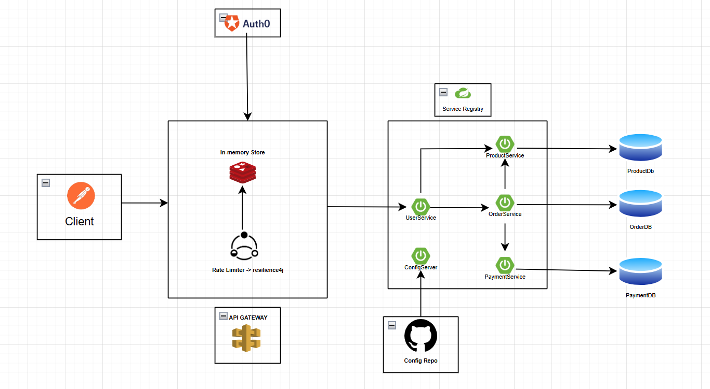

# OrderService Microservices

## Overview

OrderService is the orchestrator of the ShoppingCart system. It manages the lifecycle of an order, including creation, status tracking, and history retrieval. It interacts with the ProductService for inventory management and the PaymentService for transaction processing.

# High Level Design

## Tech Stack

  - **Framework:** Spring Boot 3.2.2
  - **Language:** Java 17
  - **Database:** MySQL
  - **ORM:** Spring Data JPA / Hibernate
  - **Build Tool:** Maven
  - **Logging:** Log4j2
  - **Code Generation:** Lombok

## Features Implemented

1.  **Order Management**

      - Create new orders with specific products, quantities, and payment modes.
      - Update existing order details.
      - Delete/Cancel orders by ID.

2.  **Order Retrieval**

      - Get comprehensive order details including nested Product information.
      - List all orders in the system.

3.  **Logging & Monitoring**

      - Integrated **Log4j2** for tracking order processing steps and debugging.

## Prerequisites

  - Java (JDK 17 or later)
  - Maven
  - MySQL Server

## Setup & Running the Application

1.  **Clone the Repository:**

    ```sh
    git clone https://github.com/yourusername/OrderService.git
    cd OrderService
    ```

2.  **Build the Application:**

    ```sh
    ./mvnw clean install
    ```

3.  **Run the Application:**

    ```sh
    ./mvnw spring-boot:run
    ```

    The application starts on **port 8082** (or your configured port).

4.  **Access the Database Console:**

      - JDBC URL: `jdbc:mysql://${DB_HOST:localhost}:3306/orderdb`
      - Set credentials in `src/main/resources/application.yaml`.

## API Endpoints

Base path: `/order`

### Order Management API

| Method | Endpoint | Description |
|--------|----------|-------------|
| POST | `/order/createOrder` | Create a new order and return Order ID |
| GET | `/order/getOrderById/{orderId}` | Get order details with Product info |
| GET | `/order/getAllOrders` | Retrieve a list of all orders |
| PUT | `/order/updateOrder/{orderId}` | Update an existing order |
| DELETE | `/order/deleteOrder/{orderId}` | Delete an order record by ID |

-----

### Request/Response Examples

  - **Create Order:**

    ```http
    POST /order/createOrder
    ```

    **Request Body:**

    ```json
    {
      "productId": 105,
      "totalAmount": 99900,
      "quantity": 1,
      "paymentMode": "CREDIT_CARD"
    }
    ```

    **Response:** `200 OK` (Returns Order ID, e.g., `1`).

  - **Get Order by ID:**

    ```http
    GET /order/getOrderById/1
    ```

    **Response:** `200 OK`

    ```json
    {
      "orderId": 1,
      "orderDate": "2024-05-20T14:30:00Z",
      "orderStatus": "PLACED",
      "amount": 99900,
      "productDetails": {
        "productName": "iPhone 15 Pro",
        "productId": 105,
        "quantity": 1,
        "price": 99900
      }
    }
    ```

## Database Schema

### Entity: Order (Table: `ORDER_DETAILS`)

| Column | Type | Description |
|--------|------|-------------|
| `id` | long | Primary Key (Auto-generated) |
| `PRODUCT_ID` | long | Reference to the Product |
| `QUANTITY` | long | Number of items ordered |
| `ORDER_DATE` | Instant | Timestamp of order creation |
| `ORDER_STATUS`| String | Status (e.g., PLACED, CANCELLED) |
| `AMOUNT` | long | Total order amount |

### DTOs & Enums

  - **OrderRequest** – Data required to initiate an order.
  - **OrderResponse** – Detailed view of the order, including nested **ProductDetails**.
  - **PaymentMode** – Enum: `CASH`, `PAYPAL`, `DEBIT_CARD`, `CREDIT_CARD`.
  - **ProductResponse** – Standard DTO for product data exchange.

## Design Patterns

1.  **N-Tier (Layered) Architecture** – Controller → Service → Repository.
2.  **Data Transfer Object (DTO) Pattern** – Used for decoupling API responses from the database schema.
3.  **Builder Pattern** – Extensive use of `@Builder` for constructing complex responses like `OrderResponse`.
4.  **Composition** – `OrderResponse` composes `ProductDetails` to provide a unified view.
5.  **Inversion of Control (IoC)** – Dependency injection of `OrderService` into the controller.

## Future Enhancements

  - Implement **Saga Pattern** for distributed transaction management.
  - Implement Order status workflow (CREATED -\> PAID -\> SHIPPED -\> DELIVERED).

